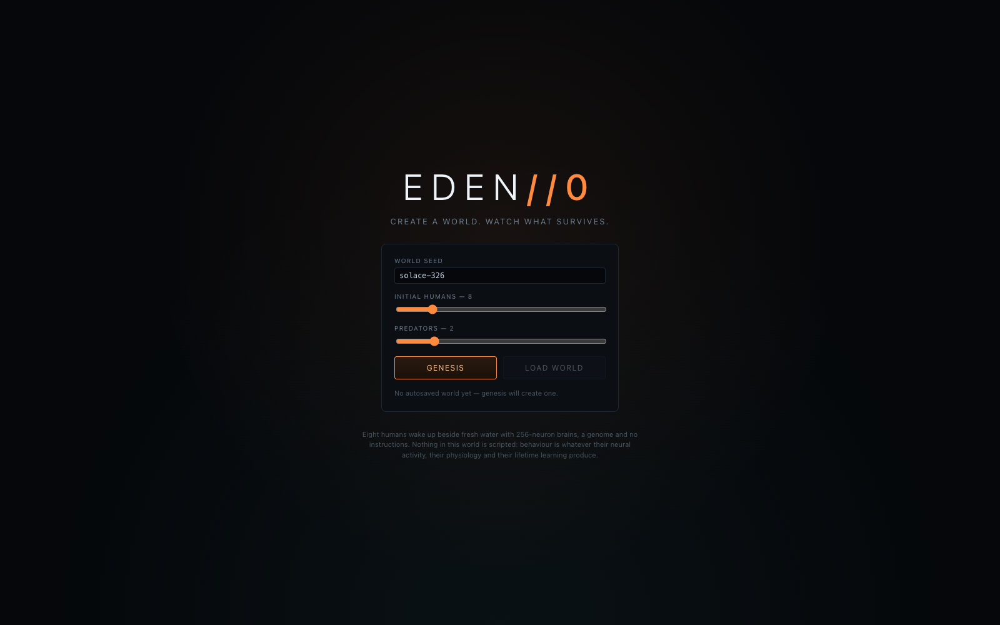
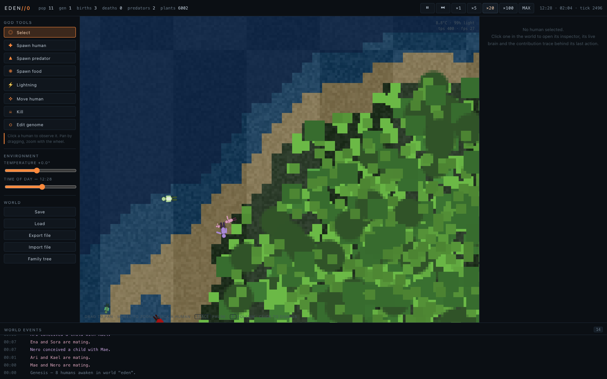
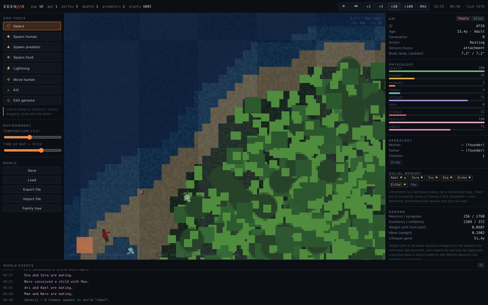
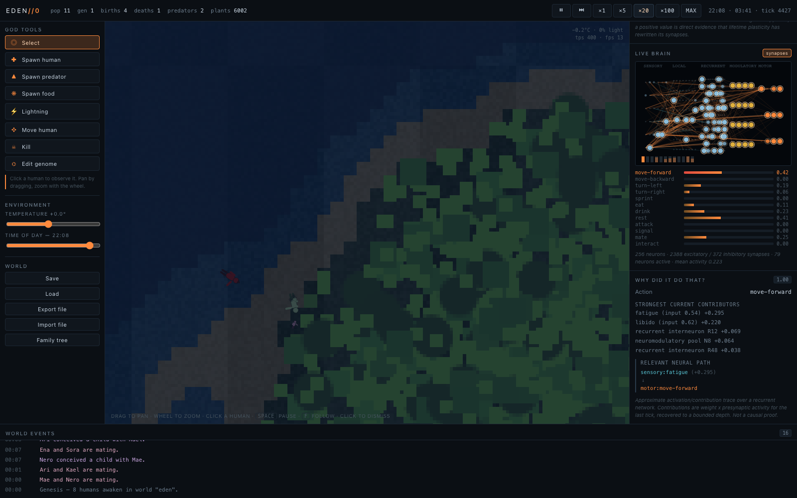
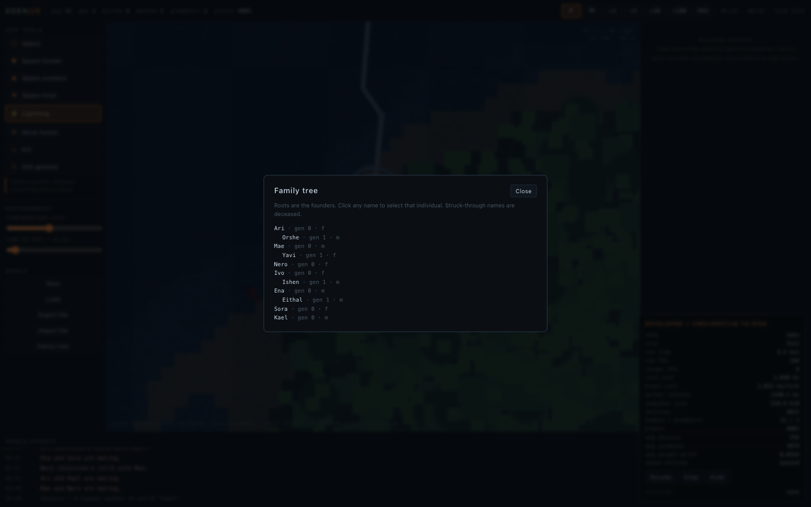

# EDEN//0

### Artificial Life Observatory

**You don't control life. You define its laws.**

EDEN//0 is a desktop artificial-life god simulator. You open a small world, eight
humans wake up beside fresh water with nothing but a genome and a 256-neuron
brain, and you watch what survives. You can intervene — spawn, kill, strike with
lightning, edit a genome — but you never take the wheel.

---

## What this is, and what it is not

**It is** a simulation in which behaviour is *not written down anywhere*. There is
no behaviour tree, no state machine, no scripted `findFood()` or `fleeFromPredator()`,
and no LLM driving anyone. Humans move, eat, drink, rest, fight, court and mate
because their neural activity, their physiology and their lifetime learning
produce motor commands — and those commands are the only thing the world reacts to.

**It is not** a scientific model of *Drosophila*, and it is not a claim of
biological fidelity. See the honesty section below.

---

## The emergence principle

The central design rule of this project is: **do not script interesting
behaviour.** Instead of high-level decisions, a human is given three things.

**Sensory inputs** — 32 channels covering vision (food, water, conspecifics and
threats, each encoded with graded egocentric direction), touch, pain, cold, heat,
light level, hunger, thirst, fatigue, energy, health, stress, libido, fertility,
familiarity, attachment and an internal noise channel.

**Internal state** — energy, hunger, thirst, fatigue, health, pain, body
temperature, stress, fertility, libido, attachment modulation, pregnancy, and
biological age. Several of these *modulate the senses upstream of the network*: a
hungry animal literally sees food more strongly, and a thirsty one smells water
from further away. That is homeostatic gain control, not a decision.

**Low-level outputs** — twelve motor neurons: move forward/backward, turn
left/right, sprint, eat, drink, rest, attack, signal, mate, interact. Movement
physics reads the first five directly; the rest are proximity-gated reflexes.

Everything else — foraging routes, who approaches whom, who fights, who pairs
with whom, which lineages survive — is emergent.

---

## The brain

A **Drosophila-inspired executable neural architecture**, not the FlyWire
connectome. The project deliberately does **not** embed or redistribute FlyWire
datasets, and does **not** attempt to simulate ~139,000 neurons per individual.

Each human has a sparse recurrent network of **256 neurons** and roughly
**2,000–5,000 synapses** (configurable through the genome):

```
  sensory (32)  →  local processing (64)  →  recurrent interneurons (132)
                                              →  neuromodulatory pool (16)
                                              →  motor (12)
```

The model is **Leaky Integrate-and-Fire**: neurons have a membrane potential and
a refractory period, the network is recurrent and sparse, and weights are plastic.
Sensory neurons are **rate-coded** — receptor cells have an approximately linear
intensity curve, and an animal cannot afford to have a faint scent dropped because
it failed to cross a spike threshold. Everything downstream of the sensory layer
is genuinely spiking.

Three mechanisms make a randomly-initialised network behave like an animal rather
than like noise, and all three are biologically motivated:

- **Global inhibitory feedback.** A slowly-adapting inhibitory pool normalises the
  network toward a sparse operating point. Without it the recurrent core either
  sits silent forever or runs away to saturation — both of which happened during
  development.
- **Afferent gain.** Sensory afferents are stronger than the intrinsic recurrent
  matrix, mirroring thalamocortical input, so the senses are not swamped by
  background activity.
- **Innate priors.** A small set of strong, *plastic* synapses implements
  survival-critical reflex arcs: nociceptive withdrawal, homeostatic drive
  routing, resource approach, threat avoidance. They are ordinary synapses —
  lifetime learning rewrites them.

The network is deterministic under a fixed seed. Given the same seed and the same
interventions, the same history unfolds, tick for tick.

---

## Lifetime learning

Humans learn while they are alive, using **reward-modulated Hebbian plasticity**:

```
Δw = learning_rate × plasticity_gene × valence × eligibility_trace
```

`valence` is *not* a hand-authored reward table. It is derived from homeostasis —
the sign and magnitude of change in energy, thirst, pain, health and hunger,
accumulated over a short window. Eating and drinking produce a sharp positive
signal; being hurt produces a sharp negative one.

Three details matter:

- **Eligibility traces** let a salient event act on the recent history of neural
  coincidence, not just on the instant it happens.
- **Plasticity is gated** by |valence|. Synapses are not rewritten continuously;
  they are rewritten when something meaningful happens.
- **Homeostatic synaptic scaling** keeps each neuron's total input strength near
  its birth value, so learning changes the *pattern* of connectivity without
  running away. Without it, a valence signal that is even slightly biased positive
  grows every synapse to its clamp and every muscle saturates.

The Brain Inspector shows `weight drift` — the mean absolute change from the
weights this individual was born with. A positive number is direct evidence that
an adult brain is not the brain it was born with.

---

## Genetics and evolution

Every human has a genome of 26 heritable genes: body size, speed, metabolism,
lifespan, fertility, vision range, temperature optimum and tolerance, appearance,
**neural connectivity density, synaptic weight scale, excitatory ratio, membrane
time constant, plasticity rate, neuromodulator gain, and a brain seed that
determines the wiring pattern**.

Reproduction is `mother × father → crossover → mutation → offspring`. Each gene is
inherited from one parent or blended; a small fraction of genes mutate, drawn in
normalised gene space so a 0.05 sigma means the same thing for body size and for
lifespan. Mutations are symmetric — they can increase or decrease a trait, and are
explicitly **not** biased toward fitness. A separate structural mutation
re-wires the brain by perturbing the brain seed.

Every newborn carries an inheritance report: which genes came from the mother,
which from the father, which were blended, and which mutated. The genome editor
shows that report alongside each gene.

---

## Building

Humans fell trees, carry the timber back to the village, and raise huts. Nothing
about the labour is scripted: no rule says "human 3 builds hut 2". The network
decides tick by tick whether to chop, carry, or lay timber, driven by the same
`wood.*` and `build.*` sensory channels as every other behaviour — and suppressed
by hunger, thirst, fatigue and pain, so a starving human forages instead of
building.

The only structural rule is that a new hut site must be staked out inside the
village (within 26 tiles of the settlement centre) and at least 5.5 tiles from any
other site, which is what keeps the result looking like a village rather than
litter.

- Trees carry **standing timber** which is a separate resource from their edible
  foliage. Felling is a lasting change: timber regrows far more slowly than
  leaves, so a logged area stays logged for a long time.
- A human carries up to 12 units. A hut takes 42.
- A site shows as four corner posts, then partial walls, then a roof, with a
  progress arc while it is under way and a hearth glow once it is finished.
- Completed huts give their occupants a **shelter** sense, which biases them to
  rest nearby — especially at night.

Two new motor outputs were added for this (`harvest`, `build`), bringing the total
to fourteen, along with twelve new sensory channels. This is the one place in the
simulation where the inhabitants change the world permanently: everything else
they do is transient, but a hut persists, and later generations are born beside it.

---

## Two ways to run a world

**Local (default).** The world lives in a Web Worker on your machine. `npm run dev`.

**Shared.** The world lives on a server and every connected observer receives the
same snapshots over a WebSocket. The simulation is the same TypeScript either way —
`World` has no DOM or Node dependency, which is what makes this possible without
forking anything.

```bash
npm run server                                  # authoritative world on :8080
# then open http://127.0.0.1:8080/?server=auto
```

The WebSocket layer is **hand-written against RFC 6455** — upgrade handshake,
masking, fragmentation, control frames, close semantics — with no `ws` dependency.
Snapshots travel as a JSON header plus concatenated `Int32Array` / `Float32Array` /
`Uint8Array` payloads in network byte order.

This is observer mode, not client-authoritative multiplayer. An observer controls
nothing that needs predicting, so there is no client-side prediction of simulation
state — the client **interpolates** between the last two snapshots so motion is
smooth at 60 fps while snapshots arrive at 20 Hz, and god commands get optimistic
local feedback reconciled against the next authoritative snapshot. Saying otherwise
would be overselling it.

**Competitive mode.** Pass `--match` to the server and the world becomes a game:
two houses, matrilineal inheritance, a scoreboard, and command authorisation so you
can only god-handle your own lineage. The same WebSocket transport and interpolation
run underneath — the match is a rules layer, not a separate build.

That interpolation is measured, not asserted: `scripts/shared-check.mjs` counts
distinct rendered positions against snapshots received. Without interpolation the
former can never exceed the latter. Current reading: **53 poses from 30 snapshots**.

`npm run smoke:server` boots the real server and drives it over a real socket.

---

## Submission notes

- **[docs/SUBMISSION.md](docs/SUBMISSION.md)** — which labs this answers, the JS
  course gap analysis, the reflection, and the honest list of what is weak.
- **[docs/PROFILING.md](docs/PROFILING.md)** — a real V8 CPU profile: where the
  time goes, and the assumption the profile disproved.
- **[docs/DEPLOY.md](docs/DEPLOY.md)** — how to put a live world on the
  internet, and why serverless hosting cannot run one.
- **[MANIFESTO.md](MANIFESTO.md)** — the Lab 42 capstone document.

---

## God interaction

You are an observer who may intervene. Tools: **spawn human**, **spawn predator**,
**spawn food**, **lightning**, **move human**, **kill**, **edit genome**,
**temperature**, and **time of day**.

Editing a genome is deliberately loud about what it does: it breaks natural
lineage conditions, and the change becomes part of that individual's future
inheritance. Every intervention is recorded in the world event feed, so the
history of your meddling stays visible.

---

## Observability

This is the part of the project with the most HCI substance.

- **Human inspector** — physiology, lifecycle, pregnancy, genealogy, and a social
  memory read-out. Attachment is a continuous value, not a relationship type:
  there are no husbands, wives or friends in this simulation.
- **Live brain view** — 256 neurons in five regions, brightness driven by smoothed
  firing rate, the strongest synapses drawn and colour-coded by sign, motor output
  bars beneath.
- **Why did it do that?** — an approximate activation/contribution trace for the
  winning motor output: which inputs contributed, by how much, and the strongest
  chain of neurons that carried the signal.
- **Family tree**, **world event timeline** (clickable, entity-aware),
  **statistics**, and a **developer panel** on `Cmd+Shift+D`.

### About "Why did it do that?"

The network is recurrent, so there is no single true cause of an action. What the
panel shows is an *engineering-level attribution*: for the motor neuron that won
the read-out, each incoming synapse is scored as `weight × presynaptic activity`,
and the strongest contributors are recovered recursively to a bounded depth. The
panel says so. It is not a causal proof and does not claim to be.

---

## Honesty about the biology

- The brain is **inspired by** insect sensorimotor organisation. It is not a
  Drosophila connectome, and no FlyWire data is embedded, redistributed or
  referenced at runtime.
- Neuron and synapse counts are chosen for tractability on a laptop, not because
  they match any organism.
- The LIF parameters are tuned for a stable, lively, playable network. They are
  not fitted to electrophysiology.
- Predators use the same neural controller as humans with different genome ranges
  and a different sensor mapping. In V0 they reproduce parthenogenetically rather
  than through a two-party mating event; this is a scope decision, documented in
  `docs/SIMULATION.md`.
- "Genes" are a small parameter vector, not a genome in any molecular sense.

---

## Ecology balance

Population dynamics were the hardest part of the project, and the fix came from
*measuring the right thing* rather than from guessing.

The first hypothesis was "they are not willing to mate". The second was "willing
adults never find each other". Those need opposite fixes, so the mating pipeline
now reports both:

```
eligible-and-willing     : 1.51 humans/tick     ← willingness was fine
willing pair in range    : 0.0001 per tick      ← encounters were the bottleneck
```

Two willing adults came within range once per ten thousand ticks. They were all
foraging in different directions and simply never met.

Three fixes followed:

- **Mate search.** Conspecific salience is now scaled by libido, and the
  `human → approach` priors went from 0.12 to 0.5 — a reproductively ready animal
  pays attention to other animals, which is what real animals do. Births went from
  4.0 to 12.6 per simulated hour and conception success from 42% to 88%.
- **Reproductive cycle.** A female was unavailable while pregnant, while
  recovering and during the mating refractory. Shortening recovery and gestation
  raised the ceiling directly.
- **Flight.** This was the real bug behind predation, and it is a *missing*
  behaviour rather than a wrong number. The threat priors were so weak that a
  frightened human backed away at ~0.5 tiles/s while a predator closed at 3.4 —
  flight was effectively disabled and humans simply stood still and were eaten.
  They now retreat at ~4.8 tiles/s. Being caught means being *cornered*.
- **Predator pressure.** Predators bit every 0.2 s and reproduced five times
  faster than they should; they also spawned uniformly across the map, where they
  starved without ever meeting anyone. Bites now land every 0.7 s, reproduction is
  far slower, and they are released in the wilderness around the village.

Measured across six seeds, 1.4 simulated hours each, from eight founders with two
predators:

```
  seed       final pop   generation   births/h  deaths/h   outcome
  eden             9          2          11.5      10.8     stable
  orion            4          2           6.5       9.4     declining
  vela             2          2           5.8      10.1     declining
  lumen            7          1           7.2       7.9     declining
  tessera         15          3          15.8      10.8     thriving
  auriga          29          3          28.8      13.7     thriving

  6/6 survived · 3/6 with births ≥ deaths · mean final population 11.0
```

Worlds no longer reliably go extinct, and two of six grew three- to fourfold.
Outcomes still vary by seed — with eight founders, genetic drift and plain luck
dominate, which is the honest behaviour of a small founding population and exactly
the situation the god tools exist for. Reproduce these numbers with:

```bash
npm run balance
```

## Current limitations

- **Ecology is viable, not tuned.** Roughly a third of seeds still decline over
  the first simulated hours. The mechanisms are all present and the population is
  no longer fragile, but the balance is not yet such that every world thrives.
  `npm run balance` exists so this can be measured rather than guessed at.
- Predator reproduction is asexual (see above).
- Human language, culture, crafting, construction, agriculture and tools are out
  of scope for V0 by design.
- Social memory accumulates but does not decay during a lifetime (the decay
  function exists but is not yet driven from the tick loop).
- The world is a single fixed 176×128 tile map; there is no world generator UI.
- Rendering uses procedural vector sprites; there are no authored art assets.
- Tick cost grows with population, because each animal scans nearby plants and
  conspecifics. It is comfortable into the low hundreds; a few thousand would need
  a different broad-phase strategy.

### Tuning harness

Because "it compiles" is not evidence that an artificial-life world works, the
repository ships two headless harnesses:

```bash
npm run sim -- --ticks 200000 --seed eden --predators 0 --every 20000
npm run balance -- --seeds eden,orion,vela --ticks 150000
```

`sim` reports population over time, births and deaths by cause, generation depth,
plant counts, mean physiology, weight drift, the motor-output distribution **and
the mating pipeline** (`eligible-and-willing`, `willing pair in range`, `pairings`,
conception success, offspring per female). `balance` runs a batch of seeds and
reports the distribution, because a single run tells you almost nothing.

---

## Development

### Requirements

- macOS on Apple Silicon (developed on an M-series MacBook Pro)
- Node.js 20+
- Rust stable (`rustup`) and Xcode Command Line Tools

### Setup

```bash
npm install
```

### Run

```bash
npm run dev            # browser dev server at http://localhost:1420
npm run desktop        # Tauri desktop app in development
```

### Test

```bash
npm test            # 138 unit + integration tests
npm run accept      # the 50-point acceptance scenario from the design brief
npm run smoke:server # boots the server and drives it over a real socket
npm run balance     # ecology across a batch of seeds
npm run bench       # per-tick cost and how it scales with population
npm run smoke:match # competitive two-house mode end-to-end
```

`npm run accept` walks the acceptance scenario end to end — genesis, autonomous
movement, time controls, observability, learning, mating, pregnancy, birth,
growth, multi-generation survival, plant reproduction, predation, death, every god
tool, and save/load equivalence — and prints a pass/fail line for each item. Items
that are purely visual are marked as requiring the running app.

### Build the macOS app

```bash
npm run app
```

`npm run app` wraps `tauri build` with the environment fixes this checkout needs
(see `scripts/build-app.sh`): it selects the Command Line Tools developer
directory, redirects `CARGO_TARGET_DIR` to a colon-free path, and moves `dist/`
aside so Vite does not have to delete it.

The bundle is written to:

```
src-tauri/target/release/bundle/macos/EDEN-0.app
```

If you prefer the raw command and your checkout path contains no `:`, plain
`npm run desktop:build` works.

### Headless simulation

```bash
npm run sim -- --ticks 200000 --seed eden
npm run brain          # neural dynamics diagnostic
```

---

## Screenshots

| | |
|---|---|
|  |  |
| **Genesis** — a seed, a population, and nothing else. | **World** — water, shoreline, vegetation, and the inhabitants. |
|  |  |
| **Inspector** — physiology, genealogy, social memory, genome. | **Live brain and contribution trace.** |
|  | |
| **Family tree** — founders and their descendants. | |

These are captures of the running application, produced by
`scripts/verify-ui.mjs`.

---

## Architecture

```
┌──────────────────────────────────────────────────────────┐
│                        Tauri 2 shell                     │
│                                                          │
│  React UI            ┌──────────────────────────────┐    │
│  ├─ controls         │        PixiJS renderer       │    │
│  ├─ inspector        │   (procedural sprites,       │    │
│  ├─ brain viewer     │    terrain + vegetation      │    │
│  └─ genealogy        │    canvases, camera)         │    │
│                      └──────────────▲───────────────┘    │
│                                     │ snapshots          │
│                      ┌──────────────┴───────────────┐    │
│                      │    Simulation Web Worker     │    │
│                      │  world · entities · brains   │    │
│                      │  genetics · reproduction     │    │
│                      │  memory · persistence        │    │
│                      │  deterministic PRNG          │    │
│                      └──────────────────────────────┘    │
└──────────────────────────────────────────────────────────┘
```

**React never runs a simulation tick.** The world lives on its own thread; the UI
sends commands and receives throttled snapshots. Entity data reaches the renderer
through a channel that bypasses React entirely, so the world animates at frame
rate while the UI updates about ten times a second.

Speed settings change *how many fixed ticks are executed*, never `dt`. The
simulation is numerically identical at ×1 and at ×1000.

See `docs/ARCHITECTURE.md` and `docs/SIMULATION.md` for the full picture.

---

## Roadmap

- **Further balance work** so a larger fraction of seeds thrive rather than merely
  survive. `npm run balance` is the measurement tool.
- **Broad-phase sensing** so tick cost stays flat into the thousands of animals.
- **Social memory decay** driven from the tick loop.
- **Sexual reproduction for predators**, reusing the human mating machinery.
- **Rust migration** of the neural update, genetic operations and spatial queries
  behind Tauri commands. The `SimWorld` interface and the worker protocol exist
  precisely so this can happen without touching the UI.
- Multi-embryo pregnancies, partial observability, and terrain that humans modify.

---

## Licence

**MIT.** See [LICENSE](LICENSE).

Use it, fork it, ship it — the only requirement is that the copyright notice
travels with the code. The simulation core carries no third-party assets: every
sprite is drawn procedurally and no ML library is used anywhere, so there is
nothing downstream to clear.
